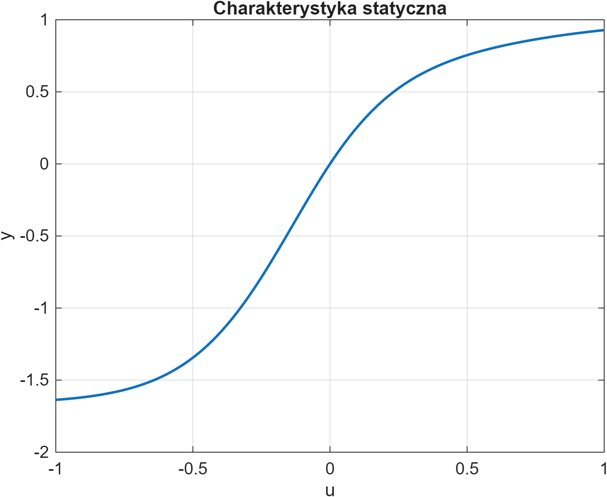

# Neural Nonlinear Predictive Control (NPL)
*(Nieliniowe sterowanie predykcyjne obiektem typu Black-Box z użyciem sieci neuronowych)*

## 📌 O projekcie
Projekt dotyczy identyfikacji oraz sterowania nieliniowym obiektem dynamicznym typu **SISO Black-Box**. Głównym celem była implementacja regulatora **NPL (Nonlinear Predictive Control with Linearization)**, w którym wytrenowana sieć neuronowa odpowiada za predykcję trajektorii swobodnej.

W ramach prac zrealizowano pełen proces modelowania (od generacji danych po wdrożenie w pętli sprzężenia zwrotnego), porównując dwa podejścia do modelowania dynamiki:
1. **ELM (Extreme Learning Machine)** –  szybka implementacja macierzowa.
2. **Model Hybrydowy** – zaawansowana architektura przy użyciu *Deep Learning Toolbox**, wykorzystująca nieliniowe transformacje wejść ($\sin, \cos$).

Dodatkowo przeprowadzono analizę algorytmów uczenia dla modelu hybrydowego, wykazując w tym przypadku przewagę optymalizatora **L-BFGS** nad algorytmem **ADAM** w kontekście szybkości zbieżności i dokładności ostatecznej predykcji.

## ⚙️ Obiekt Badań
Sterowany proces ("Proces 10") jest obiektem symulowanym, którego model matematyczny nie jest znany projektantowi.
* **Typ:** SISO (jedno wejście, jedno wyjście).
* **Identyfikacja wstępna:** W celu analizy zachowania układu wyznaczono charakterystykę statyczną $y(u)$.
* **Dynamika:** Obiekt charakteryzuje się opóźnieniem oraz silną nieliniowością.

  
   
  <em>Rys. 1: Zidentyfikowana charakterystyka statyczna obiektu.</em>

## 🧠 Modele Neuronowe i Identyfikacja

W projekcie zbadano wpływ architektury sieci oraz algorytmu uczenia na jakość predykcji.

| Model | Architektura | Metoda uczenia | Wyniki (MSE) |
|---|---|---|---|
| **ELM** | Feedforward, warstwa ukryta $\tanh$. Losowe wagi wejściowe. | Analityczna (Najmniejsze Kwadraty) | $10^{-6}$ (Bardzo dobry) |
| **Hybrydowy** | Custom Layer z transformacją trygonometryczną ($\sin, \cos$). | **L-BFGS** (Deep Learning Toolbox) | $10^{-4}$ (Dobry) |
| **Liniowy** | ARX. | Analityczna | Referencyjny (Słaby) |

**Kluczowe wnioski z identyfikacji:**
* Algorytm **L-BFGS** (Limited-memory BFGS) zapewnił znacznie szybszą zbieżność i lepszą dokładność niż standardowy algorytm **ADAM** dla badanego problemu regresji.
* Model ELM okazał się najefektywniejszy obliczeniowo przy zachowaniu najwyższej dokładności dla tego konkretnego obiektu.

## 🚀 Algorytm Sterowania: NPL
Zaimplementowano algorytm **NPL**, który stanowi wydajną obliczeniowo alternatywę dla klasycznego NMPC. Algorytm unika kosztownej optymalizacji nieliniowej online poprzez linearyzację modelu neuronowego wzdłuż trajektorii predykcji. Testy wykazały wysoką skuteczność regulacji niezależnie od punktu pracy, z najlepszymi wynikami dla modelu ELM.

**Zasada działania:**
1. **Predykcja swobodna:** Wyznaczana na pełny horyzont na podstawie nieliniowego modelu neuronowego (ELM lub Hybrydowego).
2. **Linearyzacja:** W każdym kroku sterowania wyznaczany jest lokalny model liniowy.
3. **Prawo sterowania:** Przyrosty sterowania obliczane są analitycznie, analogicznie do algorytmu DMC:

$$\Delta \mathbf{U} = (\mathbf{M}^T \mathbf{M} + \lambda \mathbf{I})^{-1} \mathbf{M}^T (\mathbf{Y}_{zad} - \mathbf{Y}^0)$$

Gdzie $\mathbf{Y}^0$ to trajektoria swobodna wyznaczona przez sieć neuronową.

## 📂 Struktura Repozytorium

### `/src` - Kody źródłowe
* **`NPL.m`** – Główny skrypt regulatora. Realizuje pętlę sprzężenia zwrotnego, predykcję neuronową i obliczanie sterowania.
* **`hybrydowy.m`** – Implementacja i trening modelu hybrydowego w Deep Learning Toolbox (L-BFGS).
* **`elm.m`** – Implementacja i trening sieci ELM.
* **`gen_datasets.m`** – Generowanie danych treningowych i testowych.
* **`wyznacz_char_statyczna.m`** – Wyznaczanie charakterystyki statycznej obiektu.
* **`leastsquares.m`** – Model ARX, metoda najmniejszych kwadratów.
* **`proces10_symulator.p`** – Symulator obiektu Black-Box (plik binarny).

### `/data` - Parametry modeli
* **`elm_params.mat`** – Wytrenowane parametry sieci ELM.
* **`dl_tbx_params.mat`** – Wytrenowane parametry modelu hybrydowego.

### `/docs` - Dokumentacja
* **`Sprawozdanie.pdf`** – Pełne sprawozdanie techniczne z testami, analizą oraz wynikami.

## 🔧 Wymagania i Uruchomienie

* **MATLAB R2025b**.
* **Deep Learning Toolbox** (wymagany dla skryptu `hybrydowy.m`).

**Instrukcja:**
1. Wygeneruj dane treningowe: uruchom `gen_datasets.m`.
2. Wytrenuj modele: uruchom `elm.m` oraz `hybrydowy.m`.
3. Uruchom symulację sterowania:
   * Otwórz `NPL.m`.
   * Wybierz model (zmienna `model = 'elm'` lub `'hybrydowy'`).
   * Uruchom skrypt.

## 📄 Licencja
Projekt udostępniony na licencji MIT.

## 👨‍💻 Autor
* **Dominik Bijoch**

---
*Projekt zrealizowany w ramach przedmiotu "Sztuczna Inteligencja w Automatyce" na Politechnice Warszawskiej (Semestr 25Z).*